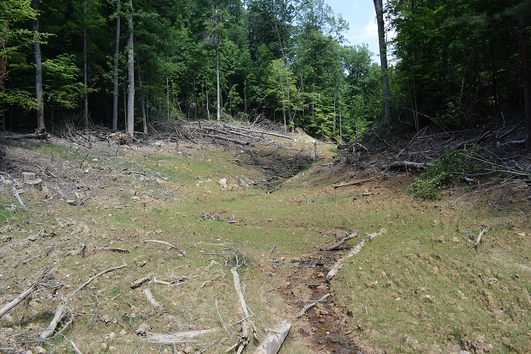

@title[unmanned aerial systems research]
### unmanned aerial systems (uas)
### research
#### @ UofL
###### D.J. Biddle, GISP
---
@title[the plan]
### the plan
- Overview of the small UAS Landscape
- Regulatory Landscape
- UAS Mapping Operations
- Structure from Motion Image Processing
- UAS Research at UofL 
---
@title[Overview of the UAS Landscape]
### A definition
> Unmanned Aerial Systems (UAS) consist of...
> - an unmanned aerial vehicle (UAV/RPV/drone)
> - a ground-based controller/operator
> - communications between the two
---
@title[Modern small UAS]
### Modern small UAS/imaging drones
- Standard Elements
 - UAV/drone 
 - Mission planning element
 - Command and control element
+++
### Modern small UAS/imaging drones
- Standard Elements
 - Communication link
 - Payload (cameras/sensors/etc)
 - Launch and recovery element (if required)
---
### Modern small UAS/imaging drones
#### Fixed wing vs multirotor
- Fixed wing
 - Simpler structure
 - Greater endurance/flight time
 - Bigger payloads (larger sensors)
 - No stationary flight
+++
### Modern small UAS/imaging drones
#### Fixed wing vs multirotor
- Multirotor
 - vertical takeoff and landing
 - hovering/precise maneuvering
 - more complex (mechanically and electronically)
 - shorter flight times/smaller payloads
+++
#### Fixed wing: SenseFly eBee

+++
#### Fixed wing: Trimble UX5

+++
#### Fixed Wing: 3DR Aero-M

+++
#### Multirotor: DJI Phantom

+++
#### Multirotor: DJI Mavic Pro

+++
#### Multirotor: 3DR X8

+++
#### Multirotor: DJI Matrice/Inspire

+++
#### Common UAS models

---
### small UAS Regulatory Landscape 
- Hobbyist/Recreational Use: No license required! BUT!
 - < 55lbs
 - flown within visual line-of-sight of operator
 - Notify ALL airports/helipads within 5 mi.
+++
### small UAS Regulatory Landscape
- Commercial Operations
 - Fly under FAA Part 107 Rules
 - Register UAS with FAA
 - Obtain Part 107 Remote PIC license
+++
### FAA Part 107 Rules
- <=400ft AGL 
- Daytime only
- Never over people
- [Permission required in special airspace (< 5mi from controlled airports)](https://app.airmap.io/)
- [FAA Part 107 Summary](https://www.faa.gov/uas/media/Part_107_Summary.pdf)
---
### Mapping applications of small UAS
- Aerial Photography/Orthomosaics
- Topographic Mapping/Digital Terrain Modelling
- Photogrammetry/Volumetric Survey
- IR/Thermal analysis
- Vegetation mapping
+++
### Mapping applications of small UAS
- Structure from Motion (SfM) image processing
 - 3D reconstruction based on point matching between overlapping images
 - Same principle as stereoscopic imagery
  - **parallax**: displacement of an object caused by a change in the point of observation
+++

+++
### Mapping applications of small UAS
- Generalized processing steps:
  1. Feature detection/image matching
  2. Point cloud generation
  3. Ground Control Point (GCP) specification (optional)
  4. Point cloud densification
  5. Mesh generation
  6. Orthomosaic/Digital Surface Model Generation
+++
### Image Processing in Pix4DMapper Pro

+++
### Image Processing in AgiSoft Photoscan

---
### UAS Research Group at UofL
- Small cohort of faculty, staff, and students
- Fleet of drones:
 - 2 x DJ Mavic Pro, 1 x DJI Phantom 4 Pro, 2 x 3DR X8, 2 x 3DR Aero
- Parrot Sequoia NIR sensor for vegetation applications
- GNSS equiment for ground control survey
- 2 FAA licensed Part 107 Remote Pilots
- Workstations and SfM software for processing imagery
+++
### UAS Research Group at UofL 
- Recent/Ongoing Projects
 - Perryville Battlefield site mapping and modelling
 - UofL Stream Institute stream restoration site mapping
 - Kavango Zambezi Vulnerability and Adaptation (KAZAVA) Project 
---
@title[Perryville Battlefield Mapping Project]
### Perryville Battlefield Mapping
###### Interdisciplinary Research Project
- Collaboration with Dr. Daniel Krebs (History Dept)
- Broad Objective: Using geospatial technology to map, model, analyze, and interpret the Civil War battle of Perryville
- Funding through the Commonwealth Center for Humanities and Society
+++
### Perryville Battlefield Mapping
- Multiple components: 
 - Georeferencing historic maps |
 - Interpreting and capturing spatial data from historic texts |
 - Time series analysis to model and interpret progression of troops during battle |
 - Terrain analysis to understand impact of topography on tactical advantages for Confederate Army |
+++
### Perryville Battlefield Terrain Analysis
- Using digital terrain data from LiDAR and UAS, recreate the setting of the battle:
 - How tall was the corn in early October? What was its impact on sightlines?
 - How tall and dense was the forest separating the battlefield from Buell's position to the West?
 - How many decibels are created by a 10 lb cannon? Under atmospheric conditions in early October?
 - Can we model the acoustic shadow? 
+++ 
### Perryville UAS Field Operations
- First large-scale mapping effort by UofL 
- 2 flights conducted on March 3rd, 2017.
- 60 acres mapped at a resolution of 2 cm
- High winds, cold temperatures, and equipment failures presented difficult conditions
- No ground control used, image EXIF data only 
+++ 

+++ 

+++ 

+++ 

+++

##### Orthophoto
+++ 

##### Cannon Detail
+++ 

##### Vegetation Detail
+++ 

##### Drone Angel!
+++
### UofL Stream Institute 
###### Stream Restoration Mapping
- Collaboration with Speed School Stream Institute
- Stream restoration projects design and build stream and wetland ecosystems
- Strip existing vegetation from site, dig/reinforce new stream channel, grade floodplain
- Mitigate erosion, promote healthy vegetation communities, aquatic life
+++

Mill Branch, Knox County, KY before stream restoration
+++

Mill Branch, Knox County, KY after stream restoration
+++
### UofL Stream Institute
###### Stream Restoration Mapping
- Improve process and add value for existing stream restoration project workflow
- UAS-derived "As Built" survey as substitute for time consuming and expensive ground survey
- Can low-cost UAS data provide accuracy necessary for precise engineering applications?
 - Horizontal and vertical accuracy of digital elevation product paramount
+++
##### Stonecoal Branch, Morehead, KY (9 acres)

+++

+++

+++
##### Site Characteristics
- 9 acres of narrow upland valley
- Sparse vegetation around channel/floodplain
- Mature trees lining restoration site
- Steep gradient from upvalley end to downvalley end (200ft elevation change)
+++
##### Challenges to UAS Operations
- Narrow site necessitates flight high above tallest trees
 - limits potential resolution
- Steep gradient changes ground sampling distance/resolution
 - SfM software expects consistent GSD throughout image
- Wooded surrounding area presents risk of equipment loss
+++
##### Field operations
- Sept 9th, 2017
- Variable lighting conditions 
 - strong, shifting shadows throughout the day
- Stream Institute conducted ground control survey using robotic total station
- 2 flights at 100m elevation with DJI Phantom 4 Pro
- Resulting data at 2cm resolution, Horiz/Vert error < 6"
+++

+++

+++

+++

Orthophoto
+++

Orthophoto Detail
+++

DSM
+++

DSM Detail
+++

1 foot contour lines
+++
###### 3D Site Model
https://www.dronedeploy.com/app2/data/59c9bd7d52db903288ddf60d 
+++
#### KAZAVA Vulnerability and Adaptation Project
- Broad objective:
 > Facilitate a broader understanding of how livelihoods, land use, and the environment are changing in a transfrontier conservation area in Southern Africa
+++
#### KAZAVA Vulnerability and Adaptation Project
- Broad objective:
 > Determine leverage points in a conceptual framework that might mitigate how land-use decisions and land-cover change affect household vulnerability
+++
 
+++
#### KAZAVA Vulnerability and Adaptation Project
- Surveys (n=480) to measure household capitals (economic, human, natural, physical, social)
- Moderate resolution satellite imagery (Landsat/RapidEye) to measure vegetation productivity at landscape scale
- Targeted UAS imagery to link household survey/resilience to coarser satellite imagery
- Fractional land-cover estimates based on UAS-derived training data 
- Remotely-sensed estimates of household vulnerability from climate variability
+++
#### KAZAVA Field Operations
- Dry season, June 2018
- 60 flights
- 100m altitude, 200x200m footprints
- DJI Mavic Pro w/ Parrot Sequoia mulstipectral sensor
+++
@transition[fade-in fade-out]

+++
@transition[fade-in fade-out]

+++
@transition[fade-in fade-out]

+++
@transition[fade-in fade-out]

+++
@transition[fade-in fade-out]

+++
@transition[fade-in fade-out]

+++
@transition[fade-in fade-out]

+++
@transition[fade-in fade-out]

+++
@transition[fade-in fade-out]

---
### Thanks!
##### Any Questions? 

 

